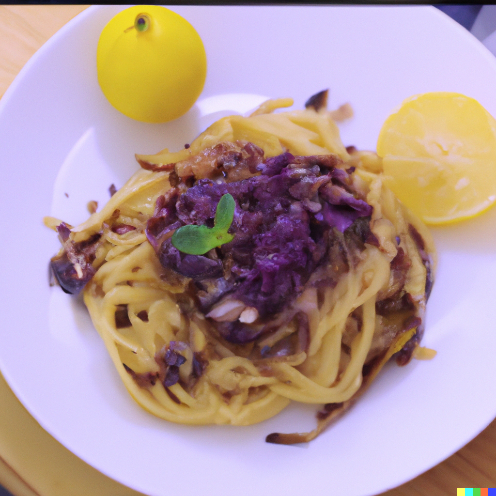

Lisa's specialty. With an inexplicable aurora, this bolognese is so exotic that you can never have enough. Did she actually enchant it with some kind of magic?

A Genshin twist on an ordinary dish!

## Ingredients

##### Dough Recipe (Part A)

* 2 Medium Eggs
* 1.5 Cups Bread Flour

##### Cacio E Pepe (Part B)

* 1 Cup Pecorino Romano 
* 1/2 Cup Hot Water

##### (Part C)

* 1 Tbsp Pink Peppercorns
* 250g Spaghetti

##### (Part D)

* 1/2 Red Onion
* Oil
* Salt and Pepper

## Method

1.) Sift bread flour and make a well. Place 2 beaten medium eggs into the well and slowly incorporate the flour until a dough forms. Knead the dough for 15 minutes by hand, then wrap in cling film and let it rest at room temperature for 2 hours. 

2.) After 2 hours, divide the dough in half and roll out with a rolling pin. Pass the dough through a pasta machine and cut it with a spaghetti cutter. 

3.) Toast pink peppercorns in a pan for 1 minute, then add 1/2 cup of pasta water. 

4.) Meanwhile, cook fresh spaghetti in boiling water for 1 minute. Toss the spaghetti with the peppercorns and mix in PART B. Continue to toss until desired consistency is achieved, approximately 2-3 minutes. 

5.) Saute red onions with salt and pepper on high heat. 

6.) NOW LET'S PLATE!