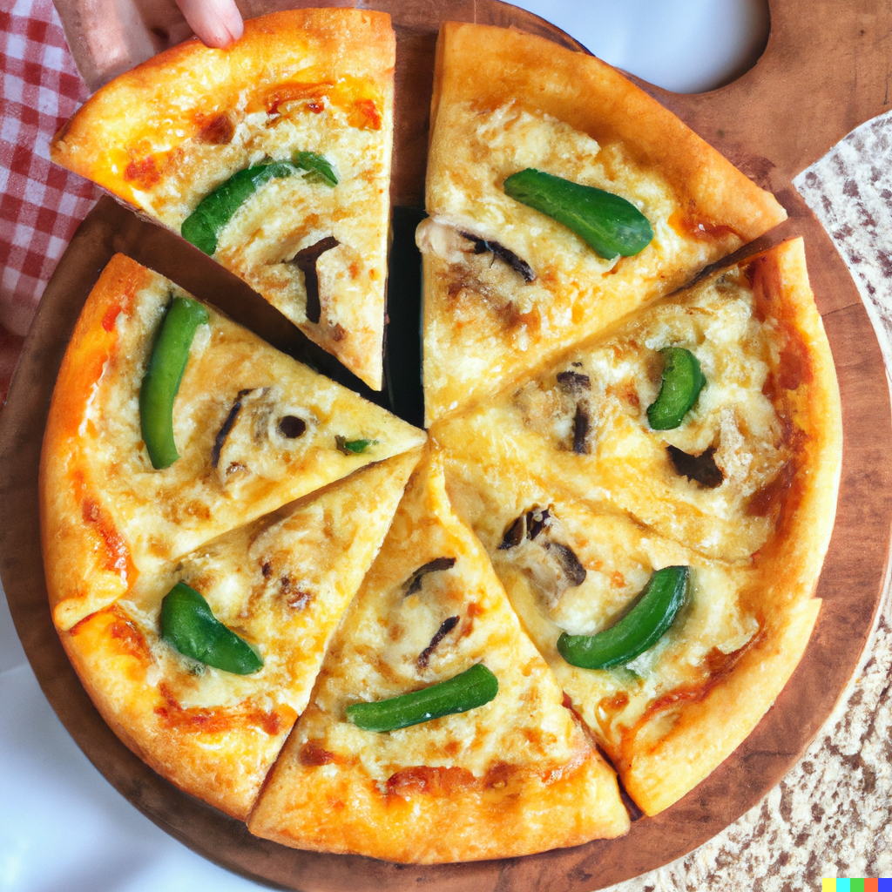

Jean's specialty. This pizza almost seems more art than food. Just one slice is enough to have you raring to go. Is this what keeps Jean working so hard? 

## Ingredients

##### Dough 

**PART A**

* 3/4 Cups WARM Water
* 7g Yeast
* 1/2 tsp Sugar

**PART B**

* 2 Cups AP Flour
* 1/2 tsp Sugar
* 1 tsp Salt

##### Garlic Cheese Sauce

* 1 bulb Garlic
* 1 Tbsp AP Flour
* 1 Stick of Butter
* 500ml Whipping Cream
* 250ml Cheese Blend

##### Tomato Sauce

* 6 oz tomato paste

  * 5 oz tomato sauce

  * 1-2 Tbsps dried oregano to taste

  * 2 Tbsps Italian seasoning

  * ½ tsp garlic powder

  * ½ tsp onion powder

  * ½ Tbsp garlic salt

  * ¼ tsp freshly ground black pepper

  * 1 tsp sugar

###### Pizza Toppings

* 6 thin slices Green Bell Pepper
* 6 slices Button Mushroom

## Method

### Dough

1.) Combine Part A, mix and set aside. Ensure the water is warm, not hot. If too hot, it will kill the yeast; if too cold, it will not activate. 

2.) Mix Part B. 

3.) Once the yeast activates, add Part A to Part B and mix, using either your hands or a stand mixer. 

4.) Knead until a ball is formed with a smooth texture. 

5.) Place 1 tablespoon of Olive Oil in a bowl and put the dough on top of it, covering it in oil. Place a towel over the bowl and let the dough proof for one hour at room temperature. After one hour, the dough should have doubled in size. 

6.) Place the dough on a floured surface and roll. 

### Garlic Cheese Sauce

1.) In a pan, melt butter and saute garlic for 2 minutes.

2.) Add in flour and cook it off for 5 minutes.

3.) Add cream and stir till desired consistency is achieved.

4.) Add cheese blend and cook on medium heat, constantly stirring until all of the cheese has melted.

### Tomato Sauce

1.) Mix tomato paste and sauce together in a medium size bowl until smooth.

2.) Add the rest of the ingredients - oregano, Italian seasoning, garlic powder, onion powder, garlic salt, pepper and sugar - and stir until evenly distributed throughout the sauce.

3.) Taste and adjust seasonings to your liking.

### Assemble Pizza!

1.) Spread completed Tomato Sauce across whole circle of dough, leaving about half-an-inch for crust

2.) Repeat with a generous amount of the Garlic Cheese Sauce, using the Tomato Sauce as a placement guide. 

3.) Place sliced Green Bell Peppers around outer edge of the centre of the Pizza in a circle.

4.) Placed sliced Button Mushrooms around the inside of created Bell Pepper circle, creating a circle of themselves. 

*
*